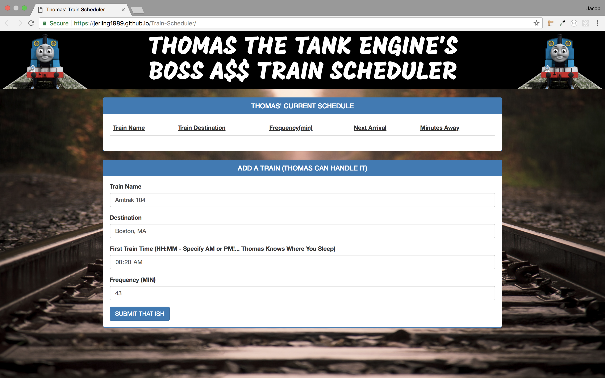
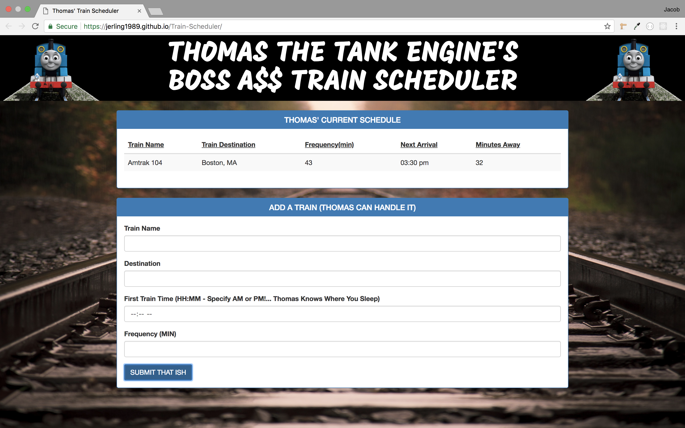
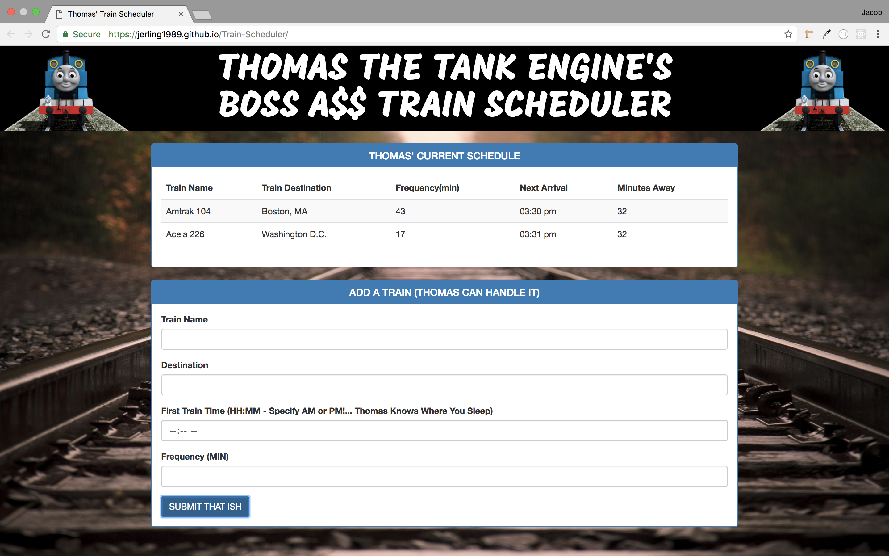

# Train-Scheduler
Here is an app designed to keep someone from missing the train. Any user can put in information about a Train Schedule and the app will keep track of the Train's progress. I designed it with HTML, CSS, Bootstrap, Javascript, and Firebase, with a little bit of tongue-in-cheek style choices.

---

- This first image displays what the user will see upon page load. There are some great nostalgic styling and desgin choices that went into this page.

- Below you can see some of the information the user can put into the form such as: Train Name, Destination, Time of the First Departure, and How often the Train comes.

- Here you can see the results of the info submitted through the form. On the Schedule Panel you can see that the Train's next arrival time and how many minutes away it is from arrival is calculated from the information the user provided.

